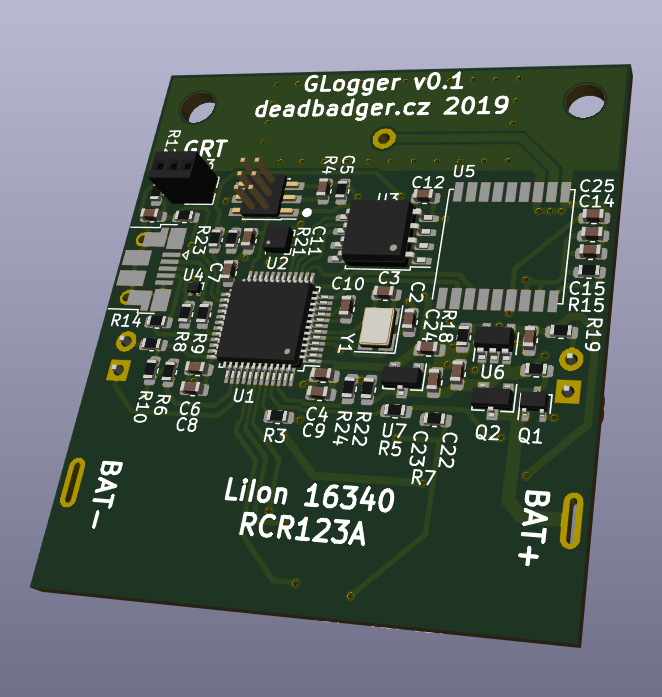

GLogger
==========

GLogger is minimalistic GPS logger designed with low power consumption in mind.

I was missing a device that would be able to log my hiking and motorbike trips
that were several days long. Using smartphone is no-go for high battery
consumption. Sport watches can work just for two or three days.
Consumer grade GPS loggers sold today are usually designed for sending GPS
location to some cloud.

Features
--------
 * Low battery consumption, can log one location per minute for several weeks,
    designed for more than 40 days of continuous operation
   (turn on at first day of your trip and forget)
 * Measuring distance travelled since power-on and since
   last clear request
 * Powered by CR123 battery or rechargeable equivalent (integrated charger)
 * Lightweight (only TODO grams with battery included)
 * Downloading data from device over USB in GPX format (easy to import to most
   of the sport trackers, etc.), no special PC side software needed

Hardware
========
 * Based on cheap STM32F0 ARM MCU
 * Cheap GPS module SIM28ML, can be replaced with U-Blox (almost pin compatible)
 * External SPI flash for GPS log storage (much lower power consumption than SD
   card)
 * Micro USB for communication with PC
 * OLED display and 2 buttons for user interaction

Software
========
 * Running on top of the [libopencm3](http://libopencm3.org/)
 * Tiny custom graphical library written just for fun
 * Used script from [ChibiOS-Contrib](https://github.com/ChibiOS/ChibiOS-Contrib/blob/master/tools/mx2board.py)
   to generate GPIO configuration from STM32CubeMx without HAL overhead
 * Real time conversion from GPS logs stored in flash to emulated FatFs GPX file

Folders
=======
 * _fw/projects_ - TrueStudio projects for firmware itself, bootloader,...
 * _fw/sources_ - All FW source files
 * _fw/sources/app_ - project specific sources
 * _hw_ - Hardware design files - PCB, enclosure,...
 * _tools_ - various helper scripts
 * _tools/cgui_ - image and font generators for custom GUI

Licensing
=========
The project files can be used under terms in [License_SW](License_SW) and
[License_HW](License_HW).
